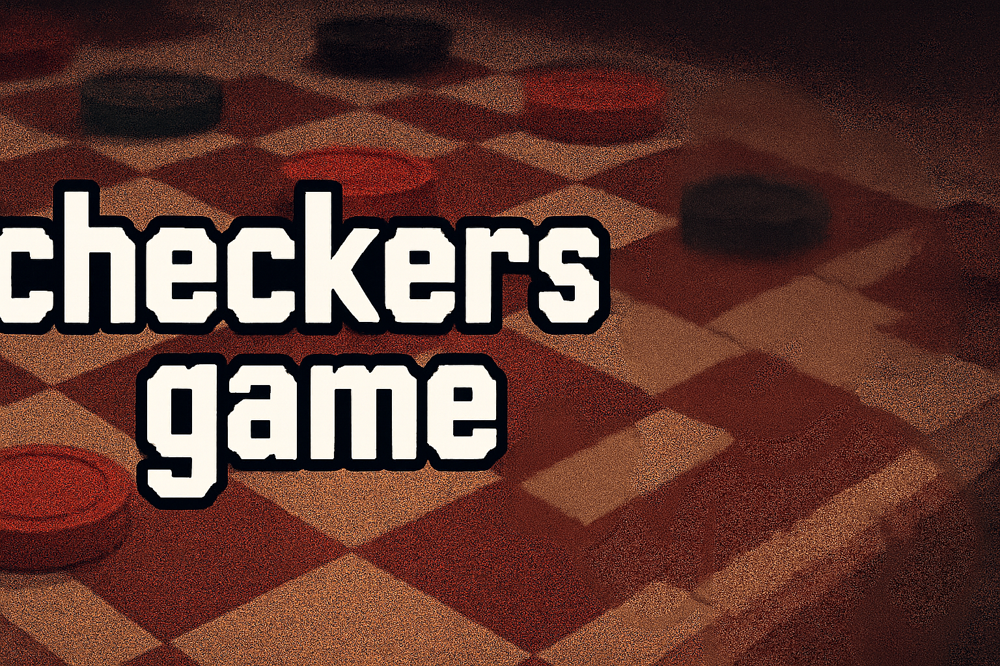
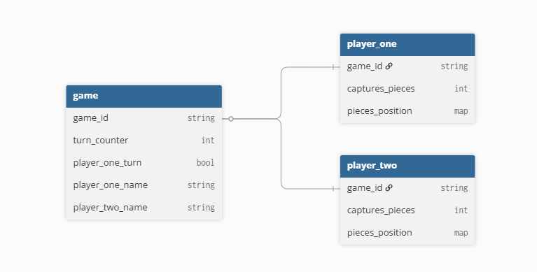

<h1 align="center">
  
</h1> 
<!-- HTML support in Markdown is pretty epic :) -->

# checkers-game
Implementation of the board game Checkers written in React/Typescript, made for a Bachelor Software Development Selection Test.

- [checkers-game](#checkers-game)
  - [Setup guide](#setup-guide)
  - [Requirements for the Game](#requirements-for-the-game)
    - [Functional Requirements](#functional-requirements)
    - [Technical Requirements](#technical-requirements)
  - [Project Approach](#project-approach)
  - [Checklist](#checklist)
  - [Database Schema Design](#database-schema-design)
  - [Known bugs](#known-bugs)
  - [SQL Database Code](#sql-database-code)

## Setup guide

Assuming you're using bash, powershell, anything which supports unix command:

1. Clone the project locally first.
```bash
git clone https://github.com/Bambaclad1/checkers-game
```

2. cd into the directory.
```bash
cd .\checkers-game\checkers-game
```

3. run `npm install` to install neccesary packages.

4. run `npm run dev` in your terminal and open the localhost window

The backend code is written in AWS lambda, thus is not debuggable from the github repo. You can acesss it in /backend however.

## Requirements for the Game
### Functional Requirements

International Draughts rules?

1. Game Board & Setup DONE
   * Board contains of 10x10 squares with alternating dark and light colors.
    Lower-left square must be dark.
   * Each player starts with 20 pieces
   * Pieces are placed the first four rows closest to each player, leaving the two central rows empty.
   * The placer with the light-colored pieces moves first, with turns alternating thereafter
2. Piece Movement & Capturing WORK
   * Ordinary Pieces DONE
     * Move one square diagonally forward into an unoccupied square
   * Capturing DONE
     * If an enemy piece is adjacent, it can-and must-be captured by jumping over it to an unoccupied square directly beyond.
     * The capture move can be executed forward or backward.
     * If a capture is available, it must be taken, even if it puts the player at a disadvantage.
     * Captured pieces are removed from the board at the end of the turn
3. Crowning (Kinging) DONE
   * A piece is crowned when it ends its turn on the farthest row of the board
   * Crowned pieces (kings) gain enhanced movement:
     * They can move multiple squares diagonally in any direction.
     * They may jump over and capture an opponnent's piece from a distance, with the freedom to choose their landing square beyond the jumped piece
4. Win Condition: DONE-ish
   * A player loses if they have no valid moves remaining. This situation arises if:
     * The player has no remaining pieces
     * All pieces are blocked by the opponents pieces and cannot move.

### Technical Requirements

1. User Interaction: DONE
    * Player clicks on a piece to select it.
    * Method for moving the piece once selected is whatever you want
2. Local Multiplayer: DONE
    * The game supports two players on one PC. No need for extra fancy stuff.
3. Game Persistance: DONE
    * Saving:
      * Provide a option for player to save current game state
      * Upon saving, game state stored in DB. Unique gameId displayed.
    * Loading:
      * Allow players to resume a saved game by entering corrosponding gameId. Loads and retrieves selected game state
      * Unknown gameId entered, proper error (404) displayed
4. Communication & API: DONE
    * Communication between frontend and backend uses RESTful API
5. Version Control: DONE
    * Use Git for version managemtn
    * Repo must be private. Use GitHub or GitLab.

## Project Approach
Always a good idea to draw the architecture before attempting something.

Sketch Tech Requirements: https://excalidraw.com/#json=0ZG0RR9ANdlzGIymjwLD0,XhrgQ8V7cHVPS7CvC3an0Q

**Tech Stack:**  
Frontend: Vite + React + Node  
Backend: Node.JS, AWS (Lambda, API Gateway)  

## Checklist  

Checklist:  
- [x] Get to know how to play checkers and how it works
- [x] Database Schema Design (ERD?)
- [x] Stack-preparation/database-create
- [x] Basic Board made
- [x] Pieces made using components (when stuck, think about tictactoe example in react docs)
- [x] Pieces movement
- [x] Switching players every play (local multiplayer)
- [x] Implement Capturing
- [x] Implement Crowning
- [ ] Multiple capture functionality
- [ ] Add win conditions
- [x] Make game load/saveable
- [ ] Celebrate!
- [ ] Extras: Menu, load menu, boardState editor for custom chess piece movement

## Database Schema Design
https://dbdiagram.io/d/Chess-Game-ERD-Diagram-6939cacde877c63074578dde

<iframe width="560" height="315" src='https://dbdiagram.io/e/6939cacde877c63074578dde/693b03c9e877c630747f6dc0'> </iframe>




## Known bugs  
See [Issues page](https://github.com/Bambaclad1/checkers-game/issues)

## SQL Database Code
personal header for saving the code to make the database

```sql
-- makes basic checkers table  

CREATE SCHEMA IF NOT EXISTS main;

DROP TABLE main.game;

CREATE TABLE IF NOT EXISTS main.game (
    game_id VARCHAR(255) PRIMARY KEY,
    board_state TEXT NOT NULL,
    player_state TEXT NOT NULL,
    player_one_turn BOOL NOT NULL,
    status VARCHAR(20) NOT NULL
);

```