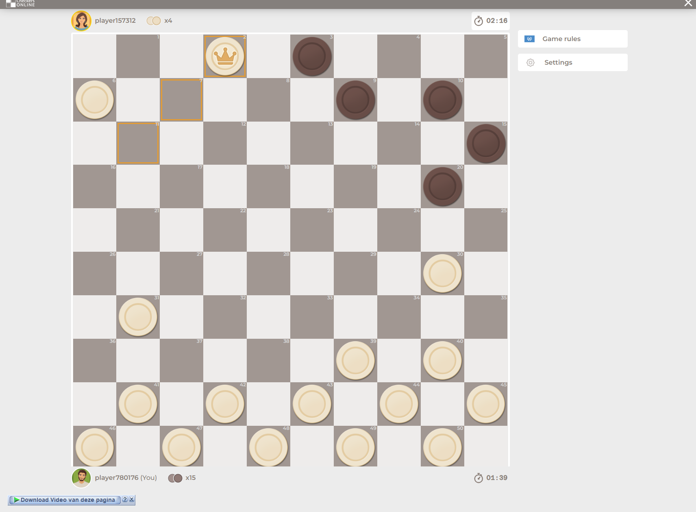
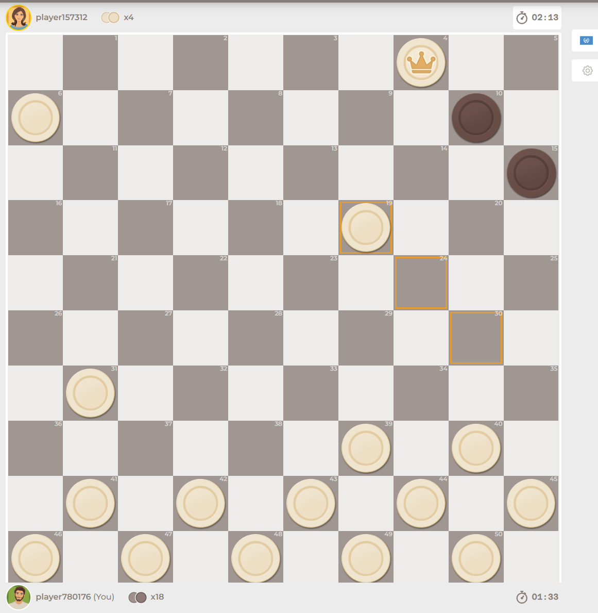
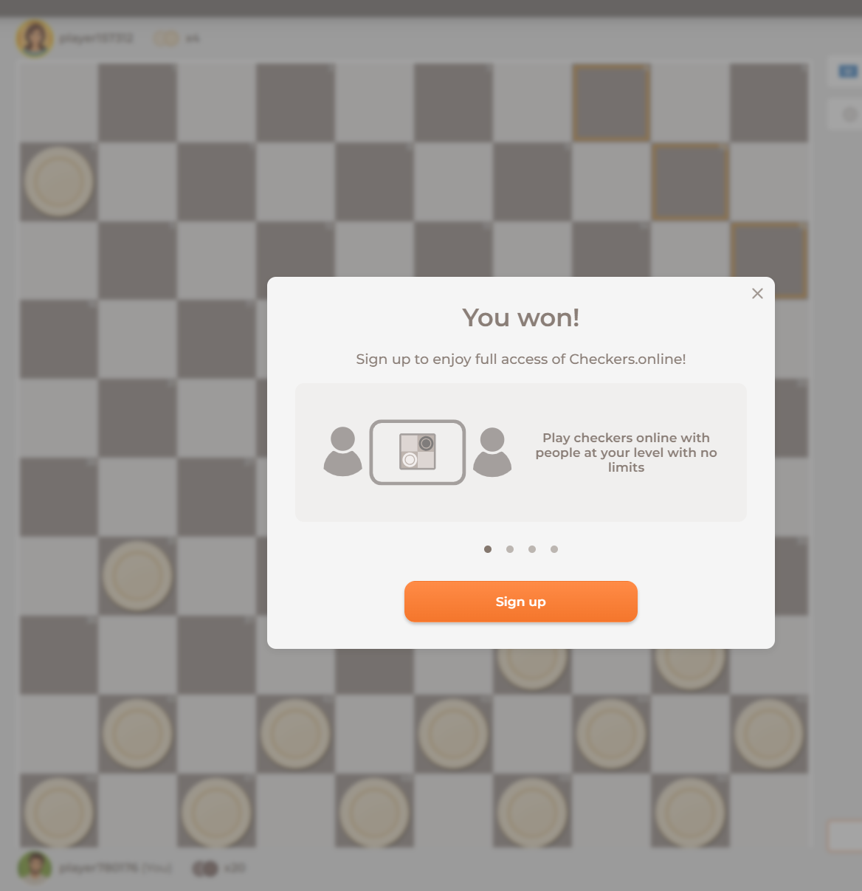

# How To Play Checkers Backlog

I started by looking at some youtube videos.
https://www.youtube.com/watch?v=MOW9k_C4vFUh  
https://www.youtube.com/watch?v=GnHQJ-PSBB0  

## General Info
Checkers is a two-player game that's played on the checkerboard.

## Game Goal
1. Capture each of your opponent's pieces
2. Make it impossible for them to move a piece.

## Game Setup
Each piece is on a dark square.  
First three rows each piece.  
Players take alternating turns moving pieces diagonally on dark squares.  
Pieces cannot be moved on the white square.  
Pieces may not move backwards. 

## Capturing
Jump over a piece diagonally to capture a piece. Dark side must be unoccupied.  
Piece is removed from a game. 
Can you capture someone? You must take that oppurtunity and can't skip the jump.  

Another jump available? Player that captured the piece must jump the next piece.

Multiple jumps available? Pick which one to jump.

## Crowning/king
Player moves their piece all the way to the opposite side of the board. Piece becomes king. (Place anther piece of the same color, but with a king logo to signify that its a king.)  
King's can move forward or backwards. Must stay on the same color as the rest of the pieces.

Now it's time to play some checkers

won my first game of checkers!  
and my second one. this is a pretty good game

I like the fact that you have to play all your moves strategically. You have to think outside the box, because when you can capture one item, you are able to keep jumping if there are more captures available. Now, how will I write this in code... let's worry about that later and make a database diagram.