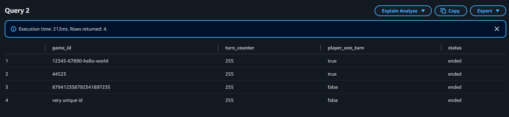
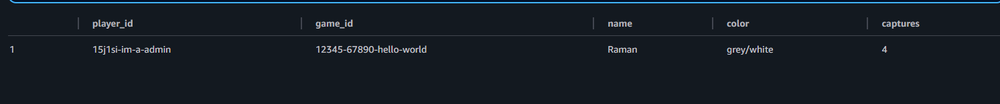
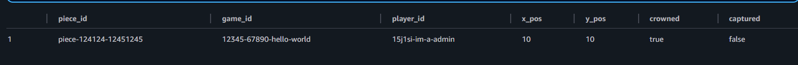
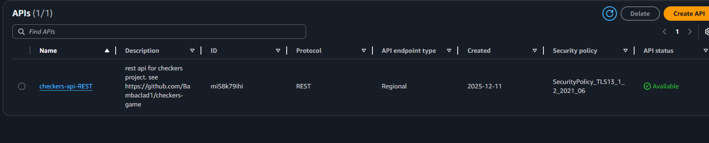
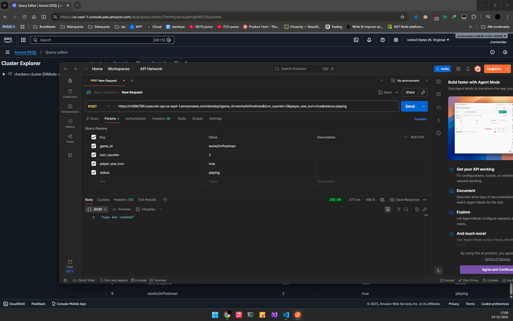

# Overview
So, I settled most of the stuff for now.
What needs to be done?

Dev Checklist
- [ ] CI Check
- [X] AWS basic Setup
- [ ] AWS Lambda Setup (crud handler)
- [ ] API Gateway Setup (sends hello world :))
- [ ] Database Connection with TypeORM towards Lambda (difficult one)
- [ ] AWS Lambda Backend Complete Intregration (ready for http requests and tested using postman)
- [x] DSQL basic setup

## CI Setup
I actually made some CI code for my previous internship, and decided to boilerplate this code (this was a part of a already existing node.js build template from github.)

CI is working! `./github/workflows/ci_build.yml`
## AWS Setup
I'm using us-east-1 because DSQL is not available on eu-north-1
### Database Setup
For the backend, I decided to use Aurora DSQL. I made a cluster,and used the example code to make a table. Now I will write a query for the current ERD.

Here we have the main.game table


Here we have the main.player table


here we have the main.piece table


That was all! We have a database. Hereby the query code:

```sql
-- makes basic checkers table  

CREATE SCHEMA IF NOT EXISTS main;

CREATE TABLE IF NOT EXISTS main.game (
    game_id VARCHAR(255) PRIMARY KEY,
    turn_counter INT NOT NULL,
    player_one_turn BOOL NOT NULL,
    status VARCHAR(20) NOT NULL
);

INSERT INTO main.game (game_id, turn_counter, player_one_turn, status)
VALUES ('12345-67890-hello-world', '255', 'true', 'ended');

SELECT * FROM main.game;

DROP TABLE main.player;

CREATE TABLE IF NOT EXISTS main.player (
    player_id VARCHAR(255) PRIMARY KEY,
    game_id VARCHAR(255) NOT NULL,
    name VARCHAR(255) NOT NULL,
    color VARCHAR(10) NOT NULL,
    captures INT NOT NULL
);

INSERT INTO main.player (player_id, game_id, name, color, captures)
VALUES ('15j1si-im-a-admin', '12345-67890-hello-world', 'Raman', 'grey/white', '4');

SELECT * FROM main.player;

CREATE TABLE IF NOT EXISTS main.piece (
    piece_id VARCHAR(255) PRIMARY KEY,
    game_id VARCHAR(255) NOT NULL,
    player_id VARCHAR(255) NOT NULL,
    x_pos INT NOT NULL,
    y_pos INT NOT NULL,
    crowned BOOL NOT NULL,
    captured BOOL NOT NULL
)

INSERT INTO main.piece (piece_id, game_id, player_id, x_pos, y_pos, crowned, captured)
VALUES ('piece-124124-12451245', '12345-67890-hello-world', '15j1si-im-a-admin', '10', '10', 'true', 'false');

SELECT * FROM main.piece;
```

### API Gateway Setup
I made a base REST api for the project.

;

I jumped out my chair and celebrated when it worked. See, this is why I code

### POST request
tedious. close connection was really confusing. apparantly its because lambda restarts and does not make a new instance everytime, but rather likes to stay warm.


special shoutout to the example offered by AWS: https://github.com/aws-samples/aurora-dsql-samples/blob/main/javascript/node-postgres/src/index.js  
couldn't do it without it

Now the things to do is:
- [ ] Get Lambda Functions ready
- [x] Develop POST route with DB call
- [ ] Develop GET route with DB call